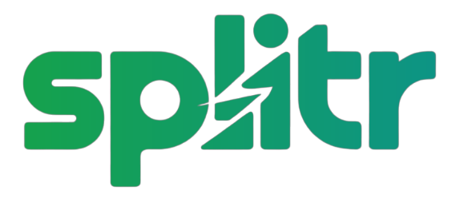

<div align="center">
  
</div>

# 🧾 Splitr

**Splitr** is a modern web application that helps you easily split expenses with friends, roommates, or family. Whether you're sharing dinner bills, travel costs, or household expenses, Splitr makes tracking and settling expenses effortless and transparent. 🤝

---

<div align="center">


</div>

---

## 💬 What People Are Saying

> "Splitr appears to be an interesting and feature-rich web application that helps users easily manage and split expenses with friends, roommates, or family. The application offers a modern and intuitive user interface, built using the latest web technologies such as Next.js, React, and Tailwind CSS."

---

## 📚 Table of Contents

- [🚀 Features](#-features)
- [📸 Screenshots](#-screenshots)
- [🛠️ Tech Stack](#-tech-stack)
- [📁 Folder Structure](#-folder-structure)
- [🏁 Getting Started](#-getting-started)
- [🙌 Contributing](#-contributing)
- [🗺️ Roadmap](#-roadmap)
- [📄 License](#-license)
- [❓ FAQ](#-faq)


---

## 🚀 Features

- 🔐 **Authentication** – Sign in and sign up securely using Clerk.
- 💸 **Expense Management** – Add, edit, categorize, and split expenses.
- 👥 **Group Support** – Create and manage groups for shared expenses.
- 💰 **Debt Settlements** – Settle up with other users and track balances.
- 📊 **Dashboard Overview** – Get a snapshot of all your financial activities.
- 📩 **Email Notifications** – Stay informed through email (powered by Resend).
- ⚙️ **Realtime Backend** – Powered by Convex for live data updates.

---

## 📸 Screenshots


## 🛠️ Tech Stack

### Frontend
- 🖼️ [Next.js](https://nextjs.org/)
- ⚛️ [React](https://reactjs.org/)
- 🎨 [Tailwind CSS](https://tailwindcss.com/)
- ✨ [shadcn/ui](https://ui.shadcn.com/)

### Backend / Services
- 💾 [Convex](https://www.convex.dev/) – Serverless backend with real-time updates
- 👤 [Clerk](https://clerk.com/) – Authentication and session management
- 🔄 [Inngest](https://www.inngest.com/) – Event-driven background jobs
- 📧 [Resend](https://resend.com/) – Transactional email service
- 🔒 [Zod](https://zod.dev/) – Type-safe schema validation

---

## 📁 Folder Structure

```bash
splitr/
├── 📁 app/                  # Next.js app directory
│   ├── 📊 dashboard/        # Dashboard pages
│   ├── 👥 groups/           # Group-related components & pages
│   └── 💸 expenses/         # Expense-related routes
├── 🧩 components/           # Reusable React components
├── 📚 lib/                  # Utility functions, API handlers, etc.
├── ☁️ convex/               # Convex backend functions and schemas
├── 🖼️ public/               # Static assets
├── 🎨 styles/               # Global styles
├── 🤫 .env.local            # Environment variables (not committed)
└── 📄 README.md             # Project documentation
```

---

## 🏁 Getting Started

### Prerequisites

- [Node.js](https://nodejs.org/) (v18 or higher)
- [npm](https://www.npmjs.com/)

### Installation

1. **Clone the repository:**
   ```bash
   git clone https://github.com/your-username/splitr.git
   cd splitr
   ```

2. **Install dependencies:**
   ```bash
   npm install
   ```

3. **Set up environment variables:**
   - Create a `.env.local` file in the root of the project.
   - Add the necessary environment variables (see `.env.example` for a template).

---

## 🙌 Contributing

Contributions are welcome! If you have any ideas, suggestions, or bug reports, please open an issue or submit a pull request.

1. Fork the Project
2. Create your Feature Branch (`git checkout -b feature/AmazingFeature`)
3. Commit your Changes (`git commit -m 'Add some AmazingFeature'`)
4. Push to the Branch (`git push origin feature/AmazingFeature`)
5. Open a Pull Request

---

## 🗺️ Roadmap

See the [open issues](https://github.com/your-username/splitr/issues) for a list of proposed features (and known issues).

---

## 📄 License

This project is licensed under the MIT License. See the `LICENSE` file for details.

---

## ❓ FAQ

- **Is this project free to use?**
  - Yes, it is open source and free to use.
